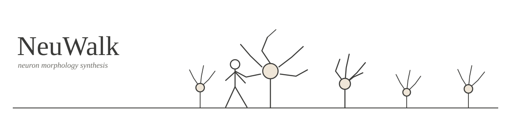

<p align="center">
  
</p>

# NeuWalk

NeuWalk is a Python package that synthesizes realistic neuron morphologies.
Using biased-and-correlated, branching-and-annihilating random walks,
it can generate dendrites and axons, with parameters fit to real morphometric data — Sholl
profiles, bifurcation counts, primary-section counts — so that generated
cells match the statistical properties of real ones.

This guide covers the essentials: installation, generating a neuron from a
built-in preset, the core concepts behind synthesis, and how to build a
custom neuron from scratch.

## Installation

```bash
pip install -e .
```

NeuWalk depends on `numpy` and `pyomo`. Fitting a tree's topology to
experimental statistics (`TopologySynthesizer.synthesize`)
also requires a nonlinear solver available to Pyomo, such as
[Ipopt](https://coin-or.github.io/Ipopt/).

## Quick start: generating a neuron from a preset

The fastest way to get a neuron is one of the built-in presets:

```python
from neuwalk.presets import neocortex
from neuwalk.visualization import plot_morphology

result = neocortex.generate_pyramidal(seed=1234)
plot_morphology(result["output"])
```

`result` is a dict; `result["output"]` is the synthesized soma (a
`Section`), ready to plot, save to SWC, or analyze.

Presets currently available:

| Preset | Cell types |
| --- | --- |
| `neuwalk.presets.neocortex` | `generate_pyramidal` |
| `neuwalk.presets.anterior_piriform_cortex` | `generate_pyramidal`, `generate_semilunar` |
| `neuwalk.presets.olfactory_bulb` | `generate_mitral`, `generate_middle_tufted` |

## Core concepts

### Sections and labels

The basic building block is a **section**: a single unbranched piece of
neurite, holding an array of 3D points and a **label** identifying what
kind of section it is (`"soma"`, `"basal_dendrite"`, `"apical_dendrite"`,
`"axon"`, and so on). A neuron is a tree of connected sections rooted at
a soma.

Two section classes are used, one at each stage of synthesis:

- `neuwalk.core.topology.SectionSynthesizer` — an abstract, geometry-free
  section used while fitting branching statistics.
- `neuwalk.core.morphology.SectionSynthesizer` — the concrete, 3D-point
  section that synthesis actually produces.

Both, and `Section` itself, share the same tree interface: `.label`,
`.parent`, `.children`, `.subtree`, `.connect(...)`.

### Two-stage synthesis

Generating a neuron happens in two stages:

1. **Topology** (`neuwalk.synthesis.TopologySynthesizer`) decides *when*
   a section bifurcates or terminates, and how many primary sections a
   tree starts with, fit to experimental Sholl plots, bifurcation
   counts, and primary-section-count ranges. The result is an abstract
   tree with no 3D geometry yet.
2. **Morphology** (`neuwalk.synthesis.MorphologySynthesizer`) walks that
   topology and synthesizes it in 3D space, one step at a time, steered
   by whatever elongation and bifurcation biases you supply.

```python
from neuwalk.random import Random
from neuwalk.synthesis import TopologySynthesizer, MorphologySynthesizer

topology = TopologySynthesizer(
    rng=Random(seed=1),
    step_size=1.0,
    bin_size=10.0,
    label="basal_dendrite",
    sholl_plot={"mean": [4, 6, 5, 2], "std": [1, 1, 1, 1]},
    bifurcation_count={"mean": 8, "std": 2},
    primary_count_range={"min": 3, "max": 6},
)
topology.synthesize_progressive()

morphology = MorphologySynthesizer(
    topology=topology.soma,
    rng=Random(seed=2),
)
soma = morphology.synthesize()
```

### Biases

The direction of synthesis is steered by **biases**, looked up from a
registry by name:

```python
from neuwalk.synthesis.morphology import biases

self_avoidance = (
    biases.get_elongation("sibling_repulsion", 25.0, -2)
    + biases.get_elongation("nonrelated_repulsion", 25.0, -2)
)
bifurcation_bias = biases.get_bifurcation("radial_torsion", 1.0)

morphology = MorphologySynthesizer(
    topology=topology.soma,
    rng=Random(seed=2),
    elongation_bias=self_avoidance,
    bifurcation_bias=bifurcation_bias,
)
```

See `neuwalk/synthesis/morphology/biases/elongation/` and
`.../bifurcation/` for every bias that's registered.

### Synthesizing several labels together

A single `MorphologySynthesizer` can synthesize primary sections of
*different* labels under one shared soma, all in one call. Any
parameter that would otherwise apply uniformly — `elongation_bias`,
`bifurcation_bias`, `theta`, `phi`, `axis_direction`, `centrifugal`,
`max_angle`, and more — can instead be given as a dict keyed by label:

```python
morphology = MorphologySynthesizer(
    topology=merged_topology,  # a soma with both labels as children
    rng=Random(seed=2),
    elongation_bias={
        "apical_dendrite": apical_bias,
        "basal_dendrite": basal_bias,
    },
    axis_direction={
        "apical_dendrite": [0, 0, 1],
        "basal_dendrite": [0, 0, -1],
    },
)
soma = morphology.synthesize()
```

Each section resolves its own value from these dicts by its own label,
falling back to a `"default"` entry when one is present. This is how the
built-in presets synthesize a cell's apical and basal dendrites, along
with any obliques grafted onto them, using a single synthesizer. See
`neuwalk/presets/neocortex/_generation.py` for a complete example,
including `neuwalk.core.topology.merge_trees` for combining two
independently-fit topologies into one shared soma, and
`neuwalk.core.topology.connect_internal_branches` for grafting one tree
onto another as internal branches (e.g. oblique dendrites).

## Reading and writing SWC files

```python
from neuwalk.io import read_swc, write_swc

roots = read_swc("morphology.swc")
write_swc("output.swc", [soma])
```

## Visualizing

```python
from neuwalk.visualization import plot_morphology

plot_morphology(soma, section_colors={"basal_dendrite": "tab:blue"})
```

## Where to go next

- `neuwalk/presets/` — complete, real-world examples of a full pipeline:
  loading experimental parameters from JSON, fitting topologies,
  composing biases, and synthesizing multi-label morphologies.
- `neuwalk/synthesis/morphology/biases/` — every available elongation
  and bifurcation bias.
- `neuwalk/analysis/` — extracting statistics (Sholl plots, bifurcation
  counts) from existing morphologies, to calibrate new presets.

## Package contents: `neuwalk.synthesis`

### `neuwalk.synthesis.morphology`

- `MorphologySynthesizer` — described above, the class that walks a
  topology and synthesizes it in 3D space.
- `neuwalk.synthesis.morphology.biases` — the bias registry
  (`get_elongation`, `get_bifurcation`), backed by:
  - **Elongation biases**: `attraction`, `ellipsoid_boundary`,
    `plane_boundary`, `sibling_repulsion`, `parent_repulsion`,
    `all_sections_repulsion`, `nonrelated_repulsion`, `root_repulsion`,
    `truncated_cone_boundary`.
  - **Bifurcation biases**: `radial_torsion`, `internal_branch`,
    `cross_torsion`.

### `neuwalk.synthesis.topology`

- `TopologySynthesizer` — described above, the class that fits a
  tree's branching statistics.
- `synthesize_progressive` — the algorithm behind
  `TopologySynthesizer.synthesize_progressive`. It fits a tree one
  Sholl bin at a time; when a bin's intersection count falls outside
  its allowed range, the tree is rolled back and that bin retried,
  progressively expanding the rollback window over earlier bins if
  attempts keep failing.
- `neuwalk.synthesis.topology.sampling.EventSampler` — samples *when*
  a section bifurcates or annihilates, from radial event densities.
- `neuwalk.synthesis.topology.sampling.estimation` — `event_rates` and
  `initial_count_pmf`, which fit those event densities and the
  initial primary-section-count distribution to experimental Sholl
  data. Used internally by `TopologySynthesizer`; not usually called
  directly.

## Command-line utilities

Two standalone scripts at the repository root work with SWC files
directly, outside of the synthesis pipeline.

### `morphplot.py`

Loads an SWC file and plots it in 3D:

```bash
python morphplot.py path/to/morphology.swc --color-sections
```

`--color-sections` colors each section by its SWC label (soma black,
axon red, basal dendrite blue, apical dendrite green).

### `morphlabeler.py`

An interactive Matplotlib viewer for relabeling sections by hand:

```bash
python morphlabeler.py path/to/morphology.swc
```

Run without a path to pick a file from a dialog instead. Click a
section to select it, choose a new label from the radio-button panel,
apply it to just that section or to its whole subtree, and save the
edited morphology back to an SWC file — all without leaving the 3D
view.
